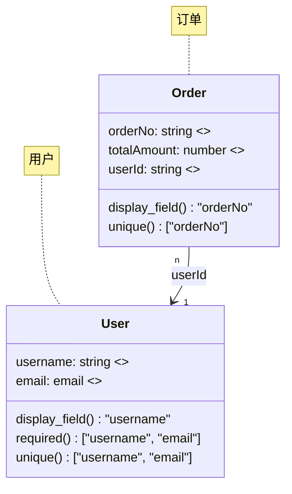

# Data Model Creation

## Activation Contract

### Use this first when

- The user explicitly wants Mermaid `classDiagram` modeling.
- The task needs complex multi-entity relational design, visual ER-style output, or generated data-model structure rather than direct SQL.
- You need to create or update CloudBase data models through the dedicated modeling tools.

### Read before writing code if

- The request mentions data model, ER diagram, Mermaid, relationship graph, or enterprise schema design.
- The user wants to reuse or update an existing published model.

### Then also read

- Direct SQL creation or schema change -> `../relational-database-tool/SKILL.md`
- Broader feature planning before schema work -> `../spec-workflow/SKILL.md`

### Do NOT use for

- Simple `CREATE TABLE`, `ALTER TABLE`, or CRUD tasks.
- Document-database collection design.
- Frontend-only data-shape discussions with no modeling requirement.

### Common mistakes / gotchas

- Using Mermaid modeling for a task that only needs one or two SQL statements.
- Mixing SQL-table design and NoSQL collection design in the same model.
- Generating diagrams without first deciding entity boundaries and ownership relations.
- Publishing a new model before validating the generated fields and relationships.

### Minimal checklist

- Confirm Mermaid modeling is actually needed.
- List the core entities and relationships first.
- Decide whether this is a new model or an update.
- Keep the initial model small unless the user explicitly wants a large enterprise schema.

## Overview

This skill is an **advanced modeling path**, not the default path for database work.

- For most database tasks, use `relational-database-tool` and write SQL directly.
- Use this skill only when diagram-driven modeling adds value.

## Quick routing

### Use `relational-database-tool` instead when

- You need `CREATE TABLE`, `ALTER TABLE`, `INSERT`, `UPDATE`, `DELETE`, or `SELECT`
- The schema is small and already clear
- The user never asked for a visual model

### Use this skill when

- You need multi-entity relationship modeling
- You need Mermaid `classDiagram` output
- You want generated model structure and documentation
- You need a clean modeling pass before SQL implementation

## How to use this skill (for a coding agent)

1. **Clarify the entity set**
   - Extract business entities, ownership, and relationship cardinality from the request.
   - Prefer 3-5 core entities unless the user clearly asks for more.

2. **Model first, then generate**
   - Draft Mermaid `classDiagram` content.
   - Validate names, field types, and relationships before calling modeling tools.

3. **Use the right tools**
   - Read/list existing models -> `manageDataModel(action="list"|"get"|"docs")`
   - Create or update a model -> `modifyDataModel`

4. **Publish carefully**
   - Prefer creating with unpublished or draft-like intent first.
   - Publish only after checking field names, required constraints, and relationship directions.

## Mermaid generation rules

### Naming

- Class names -> PascalCase
- Field names -> camelCase
- Convert Chinese business descriptions into clear English identifiers
- Keep enum values human-readable when needed

### Type mapping

| Business meaning | Mermaid type |
| --- | --- |
| text | `string` |
| number | `number` |
| boolean | `boolean` |
| enum | `x-enum` |
| email | `email` |
| phone | `phone` |
| URL | `url` |
| image | `x-image` |
| file | `x-file` |
| rich text | `x-rtf` |
| date | `date` |
| datetime | `datetime` |
| region | `x-area-code` |
| location | `x-location` |
| array | `string[]` or another explicit array type |

### Required structure conventions

- Use `required()` only for fields the user explicitly marks as required.
- Use `unique()` only for explicit uniqueness needs.
- Use `display_field()` for the human-facing label field.
- Add concise `<<description>>` notes to important fields.
- Keep relationship labels tied to actual field names rather than vague business prose.

## Minimal example

## Tool usage guidance

### Read existing models

Use this before updating an existing model or when you need naming consistency:

- `manageDataModel(action="list")`
- `manageDataModel(action="get", name="ModelName")`
- `manageDataModel(action="docs", name="ModelName")`

### Create or update model

Use `modifyDataModel` with:

- complete `mermaidDiagram`
- the correct update mode for create vs update
- a deliberate publish decision

## Best practices

1. Prefer direct SQL unless the user clearly benefits from model-first design.
2. Keep the first model iteration small and reviewable.
3. Separate business entities from implementation-only helper fields.
4. Validate relationship direction and ownership before publishing.
5. After modeling, hand off actual SQL/table work to `relational-database-tool` when needed.
